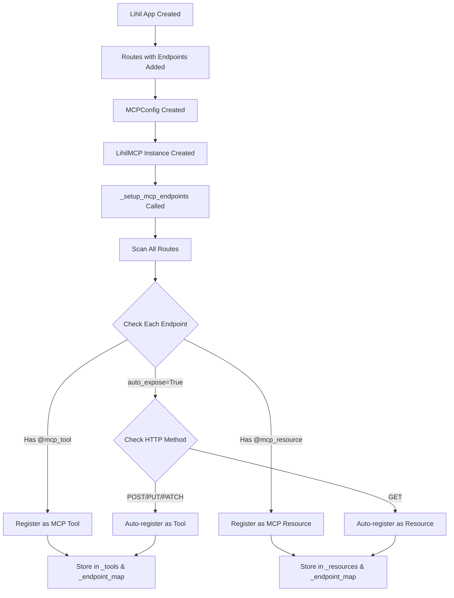

# Lihil-MCP Architecture and Request Flow

## Overview
This document describes how requests flow through the Lihil-MCP integration, showing the complete architecture from endpoint registration to execution.

## Architecture Components

```
┌─────────────────────────────────────────────────────────────────────────────────┐
│                                Lihil-MCP Architecture                           │
├─────────────────────────────────────────────────────────────────────────────────┤
│                                                                                 │
│  ┌─────────────────┐    ┌─────────────────┐    ┌─────────────────┐            │
│  │   Lihil App     │    │   MCPConfig     │    │   LihilMCP      │            │
│  │                 │    │                 │    │                 │            │
│  │ ┌─────────────┐ │    │ • server_name   │    │ • mcp_server    │            │
│  │ │   Route     │ │    │ • auto_expose   │    │ • _tools        │            │
│  │ │             │ │    │ • auth_required │    │ • _resources    │            │
│  │ │ ┌─────────┐ │ │    │ • enabled       │    │ • _endpoint_map │            │
│  │ │ │Endpoint │ │ │    └─────────────────┘    └─────────────────┘            │
│  │ │ │         │ │ │                                                           │
│  │ │ │ func()  │ │ │                                                           │
│  │ │ └─────────┘ │ │                                                           │
│  │ └─────────────┘ │                                                           │
│  └─────────────────┘                                                           │
│                                                                                 │
└─────────────────────────────────────────────────────────────────────────────────┘
```

## Request Flow

### 1. Initialization Phase



### 2. Simplified Lifespan Handling

```
ASGI Lifespan Event
         │
         ▼
   ┌─────────────────┐
   │ LihilMCP.__call__│  ◄─── ASGI wrapper
   │                 │
   └─────────────────┘
         │
         ▼
   ┌─────────────────┐
   │ Forward to      │  ◄─── Let Lihil handle its own lifespan
   │ Lihil App       │
   └─────────────────┘
         │
         ▼
   ┌─────────────────┐
   │ Lihil handles   │  ◄─── Routes and endpoints fully initialized
   │ startup         │
   └─────────────────┘
         │
         ▼
   ┌─────────────────┐
   │ Setup MCP       │  ◄─── _setup_mcp_endpoints() called
   │ Endpoints       │
   └─────────────────┘
```

### 3. MCP Tool Execution Flow

```
┌─────────────────────────────────────────────────────────────────────────────────┐
│                           MCP Tool Execution Flow                               │
└─────────────────────────────────────────────────────────────────────────────────┘

   MCP Client Request
         │
         ▼
   ┌─────────────────┐
   │   FastMCP       │  ◄─── MCP Protocol Handler
   │   Server        │
   └─────────────────┘
         │
         ▼
   ┌─────────────────┐
   │ mcp_tool_wrapper│  ◄─── Generated wrapper function
   │                 │
   └─────────────────┘
         │
         ▼
   ┌─────────────────┐
   │ _call_endpoint  │  ◄─── LihilMCP method
   │                 │
   └─────────────────┘
         │
         ▼
   ┌─────────────────┐
   │ Look up in      │  ◄─── _endpoint_map[tool_name]
   │ _endpoint_map   │
   └─────────────────┘
         │
         ▼
   ┌─────────────────┐
   │ Get Endpoint    │  ◄─── Extract endpoint object
   │ Object          │
   └─────────────────┘
         │
         ▼
   ┌─────────────────┐
   │ endpoint.       │  ◄─── The actual user function
   │ unwrapped_func  │
   └─────────────────┘
         │
         ▼
   ┌─────────────────┐
   │ Execute with    │  ◄─── Call user function with args
   │ Arguments       │
   └─────────────────┘
         │
         ▼
   ┌─────────────────┐
   │ Return Result   │  ◄─── JSON serializable result
   │ to MCP Client   │
   └─────────────────┘
```

### 4. MCP Resource Access Flow

```
┌─────────────────────────────────────────────────────────────────────────────────┐
│                          MCP Resource Access Flow                               │
└─────────────────────────────────────────────────────────────────────────────────┘

   MCP Client Request
         │
         ▼
   ┌─────────────────┐
   │   FastMCP       │  ◄─── MCP Protocol Handler
   │   Server        │
   └─────────────────┘
         │
         ▼
   ┌─────────────────┐
   │mcp_resource_    │  ◄─── Generated wrapper function
   │wrapper          │
   └─────────────────┘
         │
         ▼
   ┌─────────────────┐
   │_call_endpoint_  │  ◄─── LihilMCP method
   │as_resource      │
   └─────────────────┘
         │
         ▼
   ┌─────────────────┐
   │ Look up in      │  ◄─── _endpoint_map[resource_uri]
   │ _endpoint_map   │
   └─────────────────┘
         │
         ▼
   ┌─────────────────┐
   │ Get Endpoint    │  ◄─── Extract endpoint object
   │ Object          │
   └─────────────────┘
         │
         ▼
   ┌─────────────────┐
   │ endpoint.       │  ◄─── The actual user function
   │ unwrapped_func  │
   └─────────────────┘
         │
         ▼
   ┌─────────────────┐
   │ Execute (no     │  ◄─── Call user function
   │ arguments)      │
   └─────────────────┘
         │
         ▼
   ┌─────────────────┐
   │ Return Resource │  ◄─── JSON serializable result
   │ to MCP Client   │
   └─────────────────┘
```

## Key Data Structures

### _endpoint_map
```python
_endpoint_map: Dict[str, Endpoint] = {
    "function_name": endpoint_object,      # For tools
    "lihil://resource_uri": endpoint_object # For resources
}
```

### _tools
```python
_tools: Dict[str, MCPToolInfo] = {
    "function_name": MCPToolInfo(
        name="function_name",
        description="Function description",
        inputSchema={"type": "object", "properties": {...}}
    )
}
```

### _resources
```python
_resources: Dict[str, MCPResourceInfo] = {
    "lihil://resource_uri": MCPResourceInfo(
        uri="lihil://resource_uri",
        name="resource_name",
        description="Resource description",
        mimeType="application/json"
    )
}
```

## Registration Logic

### Manual Registration (Decorators)
```python
@mcp_tool(description="Custom tool")
def my_function():
    pass

@mcp_resource(uri_template="lihil://custom")
def my_resource():
    pass
```

### Auto-exposure Logic
```python
if config.auto_expose:
    if method in ["POST", "PUT", "PATCH"]:
        # Register as MCP Tool
    elif method == "GET":
        # Register as MCP Resource
```

## Error Handling

```
┌─────────────────┐    ┌─────────────────┐    ┌─────────────────┐
│ User Function   │───▶│ Exception       │───▶│ MCPError        │
│ Raises Error    │    │ Caught          │    │ Wrapped & Sent  │
└─────────────────┘    └─────────────────┘    └─────────────────┘
```

## Benefits of This Architecture

1. **Seamless Integration**: Lihil endpoints become MCP tools/resources automatically
2. **Type Safety**: JSON schema generation from Python type hints
3. **Flexible Registration**: Both manual decorators and auto-exposure supported
4. **Error Handling**: Proper exception wrapping and propagation
5. **Separation of Concerns**: MCP logic separate from HTTP logic
6. **Performance**: Direct function calls without HTTP overhead

## Example Usage

```python
from lihil import Lihil
from lihil.routing import Route
from lihil_mcp import LihilMCP, MCPConfig, mcp_tool

# Create Lihil app
route = Route("/api")

@route.post
@mcp_tool(description="Process data")
def process_data(data: str) -> dict:
    return {"processed": data.upper()}

@route.get
def get_status() -> dict:
    return {"status": "healthy"}

app = Lihil(route)

# Create MCP integration
config = MCPConfig(server_name="my-server", auto_expose=True)
mcp = LihilMCP(app, config)

# Now available as:
# - MCP Tool: "process_data" (manual registration)
# - MCP Resource: "lihil://api" (auto-exposed GET endpoint)
```